For Brainhack school Taiwan, we will have two Discord servers. The Discord server for Taiwan hub is ready for you to join, but the Discord server for international communication is not public until the Brainhack School start. Before the Brainhack School, you could have communication with others in Taiwan hub. And, the channels and rules in Taiwan hub are very similar to international Discord server. When the Brainhack School start and the international discord server open, you would feel easy to migrate to another environment and have great communication with people around the world. 

Here is step by step guide to help you quickly get to know how discord works.

{: .note }
For those who are already familiar with Discord and would like to skip this guide. Here is some to-dos that we hope you can followed. 
1. Get into #entrance channel, and send a message with your student ID number and name. We will verify your identify through this information.
2. Please change your username to a name by which other can identify you. 
3. Please add a profile picture to your avatar so that people can easily recognize you in channels.
4. Please make sure you would get notification whenever new announcements were posted, or someone mentioned you.

# Onboarding
Open the invitation link will lead you to this screen. Please click “join Brainhack.School.Taiwan.” Login or sign up a Discord account to continue.
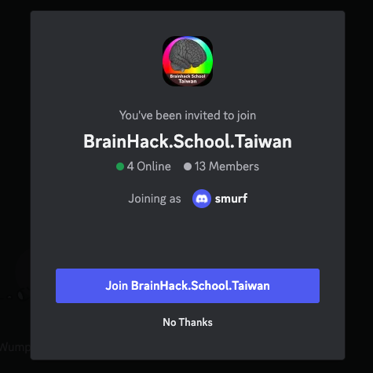

Our discord server will bring you to #entrance channels. Please input your student ID number and name in the text box and press `enter`.
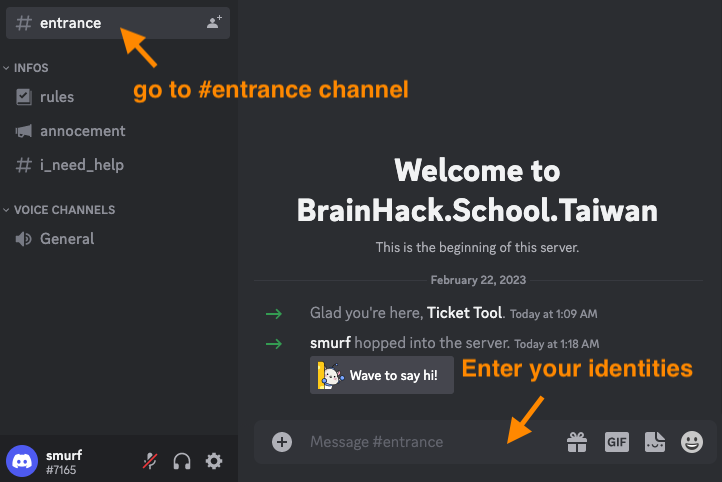

We will verify your identity (It would take a while ...). If you are granted, you will see secrete channel undet `BrainHack School TW`.
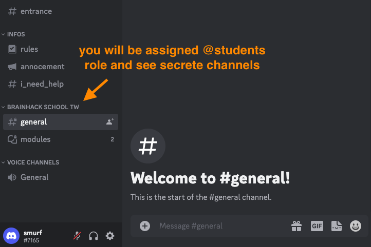

## Editing avatar
Please change your username to a name people can identify you, and replace the default profile picture to a nice and unique picture that people can easily recognize.
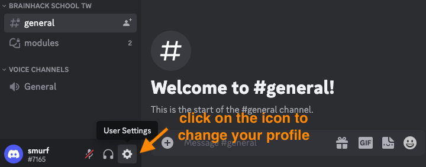
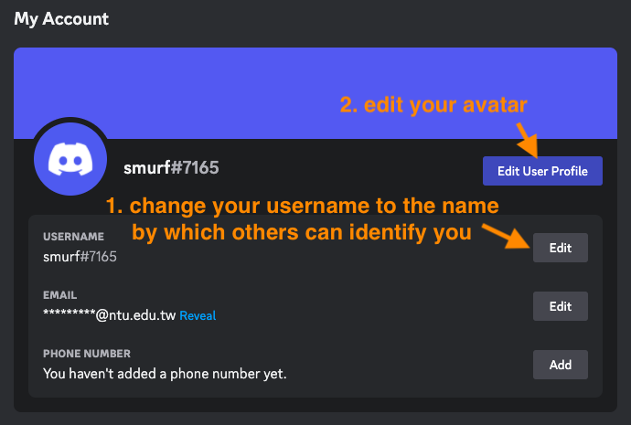
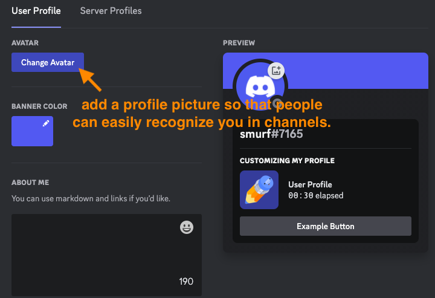

## Chaning status
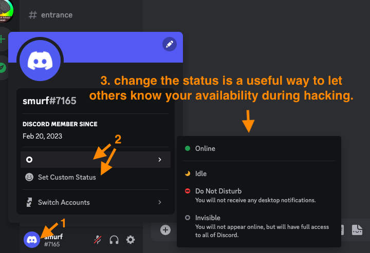

# Notification
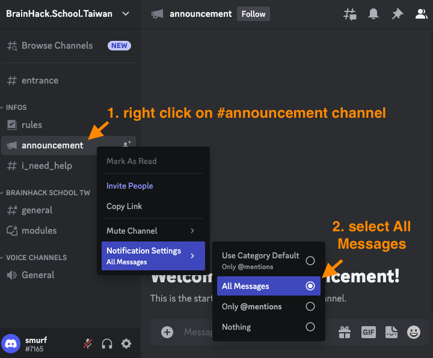
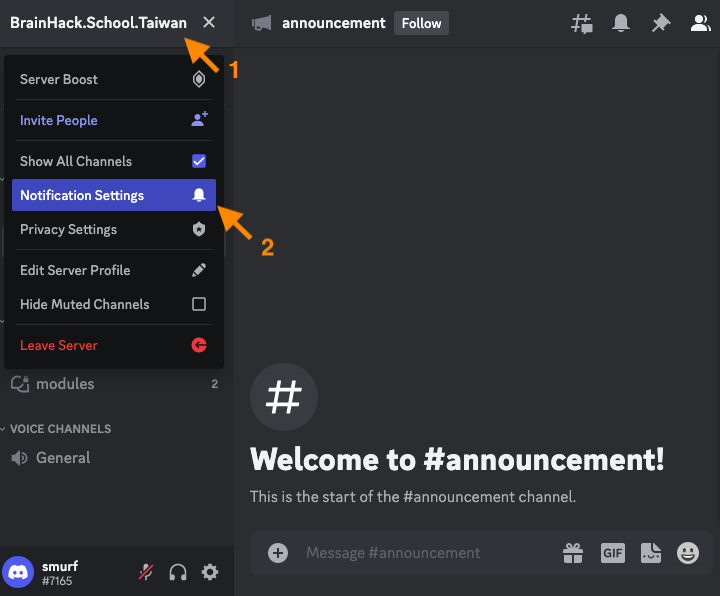
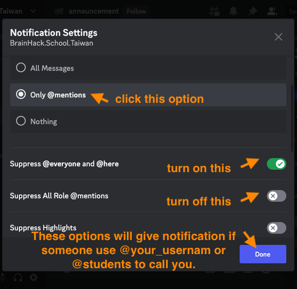

# Channels
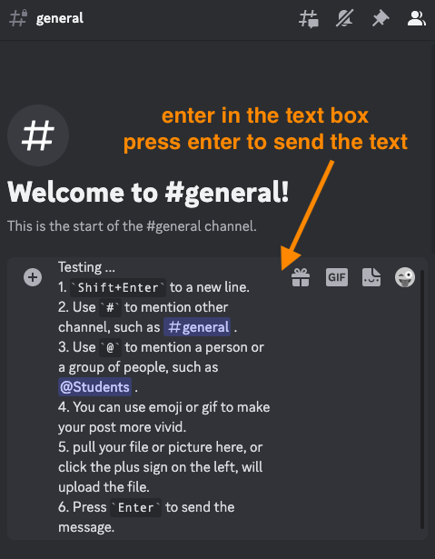
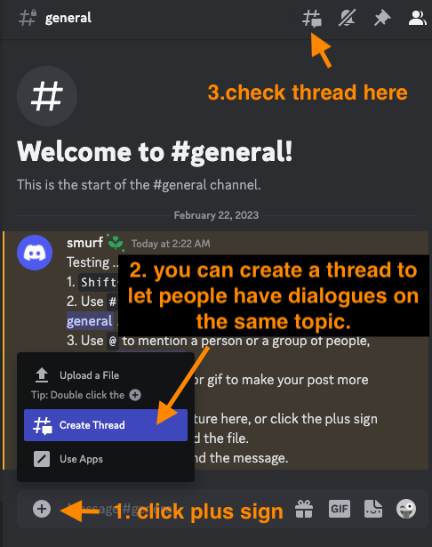
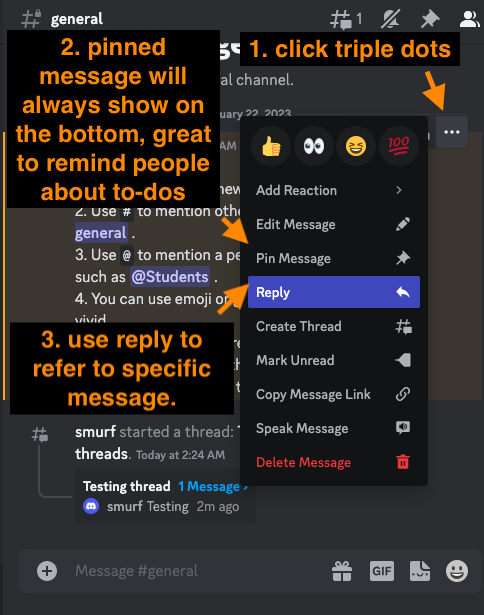
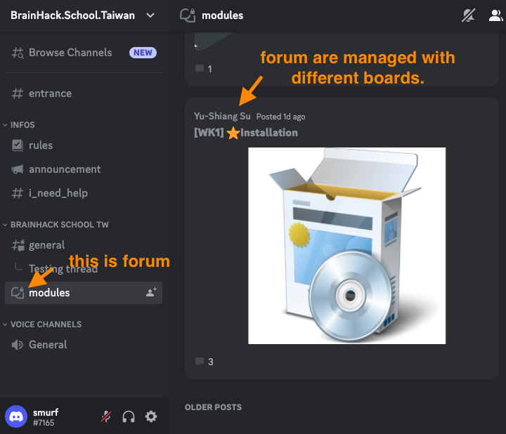
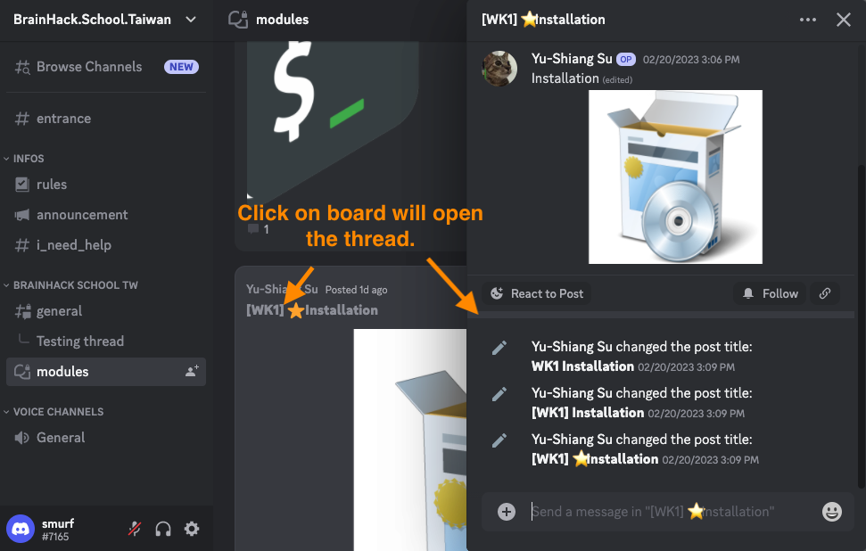

# Private message
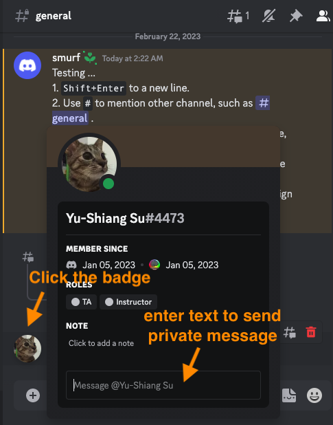
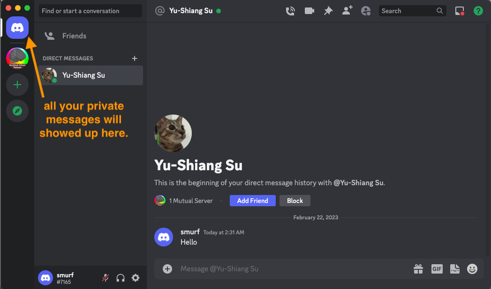

# Support ticket
Work in progress