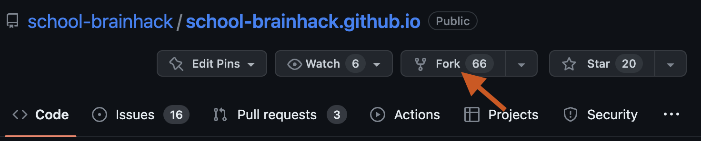
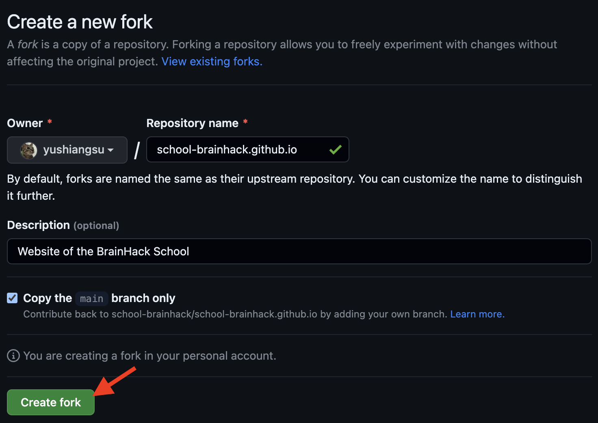
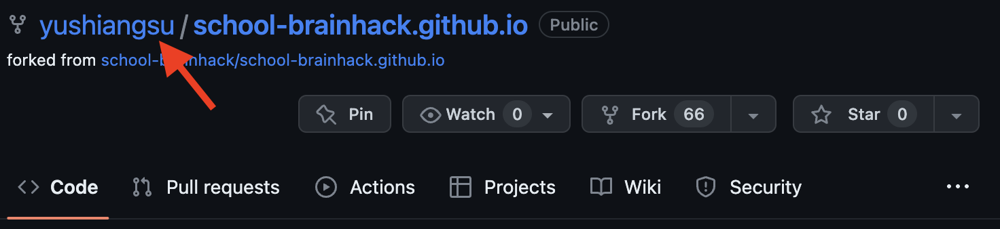
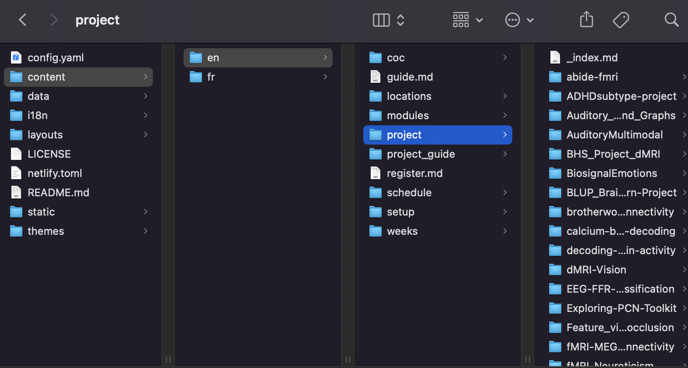
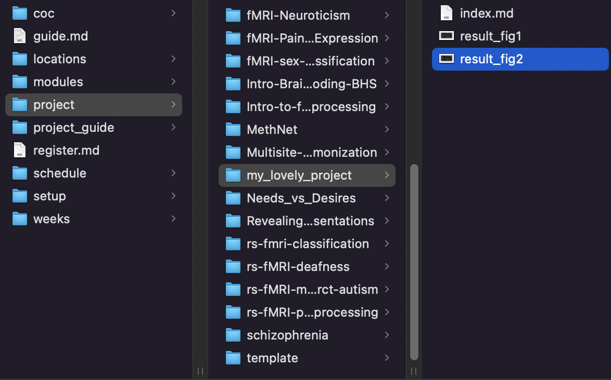
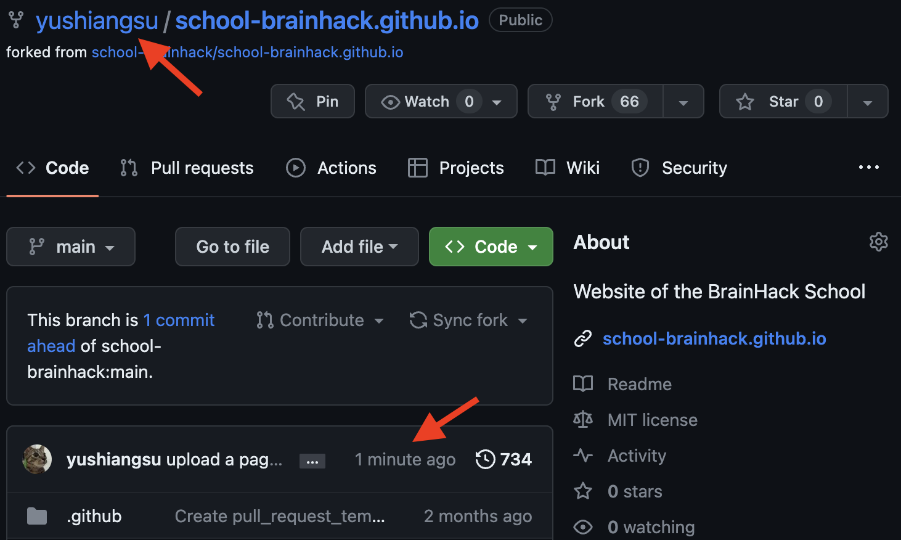
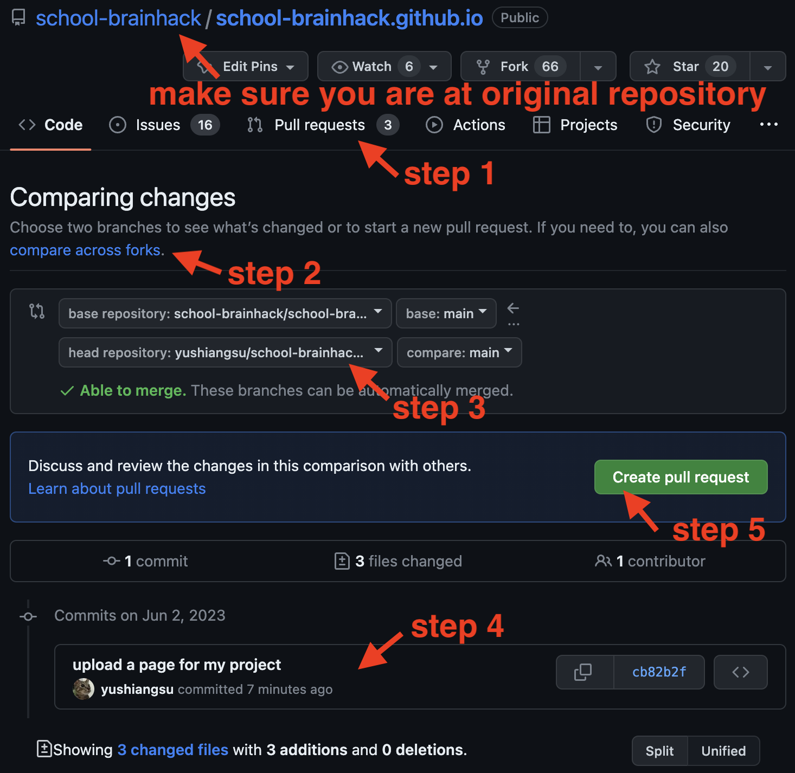

# Github guide
{: .no_toc }

# TOC
{: .no_toc .text-delta }

{:toc}

## Create Github account
Please use the [Github](https://github.com/) official webpage and follow the instruction to signup a account. (It is free!)


{: .note }
P.S. If you are a student or teacher, don't forget to join [Github Global Campus](https://education.github.com/) to get some gift from github.

---

## Learn to use Github
You can learn [how to use github](https://school-brainhack.github.io/modules/git_github) from one of our learning modules. (It is mandatory.)

---

## Github Project Submission Guide
To submit your project, you should (1) upload your slides of wrap-up presentation, and have (2) a public repository that contains your deliverables, such as code and report (or Jupyter notebook). Then, you should (3) prepare a introductory page and send a pull request to [Brainhack School project pages](https://school-brainhack.github.io/project/).

We know that it is very hard to complete a project in a month, and thus we don't expect you finish your project in the end of Brainhack School. 

### Step 1: Upload your slides
Please upload your slides [here](https://drive.google.com/drive/folders/1Z2g5syGnWE78hniOtdqsTUnWDvIikqBF)

### Step 2: Prepare a public repository on Github for your project
1. On your Github, create a public repository named `<your_name>_project`, and initialize with a `README` and `LICENSE` file. (You should already did this step in Git and Github module.)

2. Clone your remote repository to your local drive. For example, I would like to clone the files on the repository to my `Documents` folder under home directory, I can type the following code in terminal. Then, I shall found the file under `~/Documents/<your_name>_project`.
   ```
   cd ~/Documents
   # change the <USERNAME> to your github account, and <your_name> to your name on your Github repository
   git clone https://github.com/<USERNAME>/<your_name>_project.git 
   cd <your_name>_project
   ```

3. Open the `README.md` file. Copy and paste all the contents from [Brainhack School Project template](https://raw.githubusercontent.com/brainhack-school2023/project_template/main/README.md). Follow the template and modify the text to show the necessary details for your project. This `README.md` is a markdown file, so you should prepare it as markdown format, then Github and our website will render this markdown file on webpage. You can learn more about markdown format [here](https://docs.github.com/en/get-started/writing-on-github/getting-started-with-writing-and-formatting-on-github/basic-writing-and-formatting-syntax), [here](https://github.com/adam-p/markdown-here/wiki/Markdown-Cheatsheet), and [here](https://www.markdowntutorial.com/). You can embed your result figures in the `README.md` as the example showed in these links. However, please note that you should copy your figure files into the same folder, and use the relative path to embed your figures.

4. Copy all your deliverables in this folder, and commit your changes and push to repository. You have to input your Github username and [personalized token](https://docs.github.com/en/authentication/keeping-your-account-and-data-secure/managing-your-personal-access-tokens) as password.
    ```
    # You should copy all your deliverables to this folder before these lines
    # Otherwise, none of your files were uploaded
    git add -A
    git commit -m "upload my deliverables"
    git push -u origin main
    ```

5. Check your repository, you should find that all your deliverables were uploaded and `README.md` was updated. 

6. Fill a [form](https://docs.google.com/forms/d/e/1FAIpQLSc2En-59xbMBQSsNlu5KlupqdGZ5Wgt5j-evH9P7ttzeWQBSw/viewform) here to let us know you where is your repository and slides, we will evaluate your performance accordingly.

### Step 3: Fork the website and send a pull request for your project
1. Go to the [Github repository for Brainhack School website](https://github.com/school-brainhack/school-brainhack.github.io). Click the `Fork` on the page to fork this repository to your account.
   

2. Leave everything as defaults, and click `create fork`.
   

3. You should see that you fork the repository to your account.
   

4. Clone the forked repository to your local drive. Here, we demonstrated how to clone the repository to `Documents` folder.
   ```
   cd ~/Documents
   # change the <USERNAME> to your github account
   git clone https://github.com/<USERNAME>/school-brainhack.github.io.git
   cd school-brainhack.github.io
   ```

5. In the `school-brainhack.github.io` folder, navigate to `school-brainhack.github.io/content/en/project`
   

6. Create a folder for your project, then copy your `README.md` (and your figure files if you embedded in README) to the folder. Importantly, please **rename the `README.md` to `index.md`.**
   

7. Stage, commit and push to your forked repository.
    ```
    # change the <your_folder_name> to the folder name for your project
    cd content/en/project
    git add ./<your_folder_name>
    git commit -m "upload a page for my project"
    git push -u origin main
    ```

8. You should see that you commit the changes for your project on the forked repository.
    

9.  Then, get back to the original [Github repository for Brainhack School website](https://github.com/school-brainhack/school-brainhack.github.io). We will send a pull request. (step 1:) First, click the `pull request`, (step 2:) then there click an option called `compare across forks`, (step 3:) select your `<USERNAME>/school-brainhack.github.io.git` as head repository. (step 4:) Check all the commits are correct. (step 5:) Then the final step is click the `create pull request` and confirm the pull request.
    

10. We will review your pull request, and some revision might be needed. Please be patient and help us to revise your request accordingly.