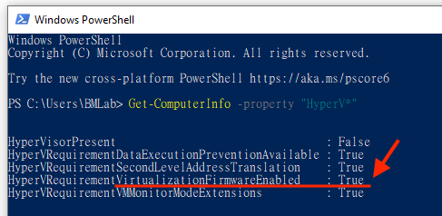
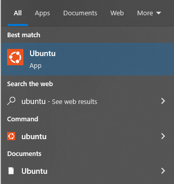
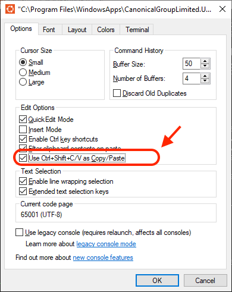
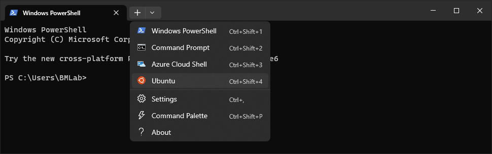
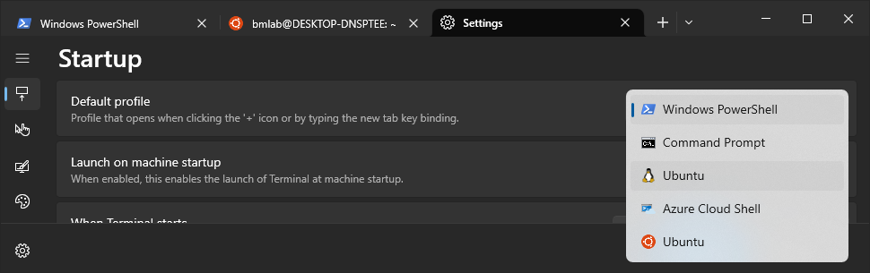
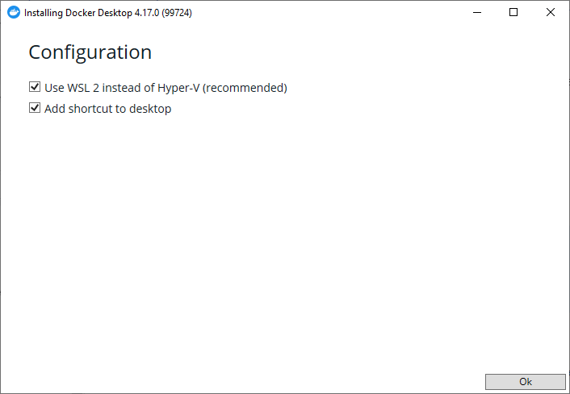
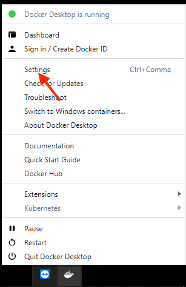
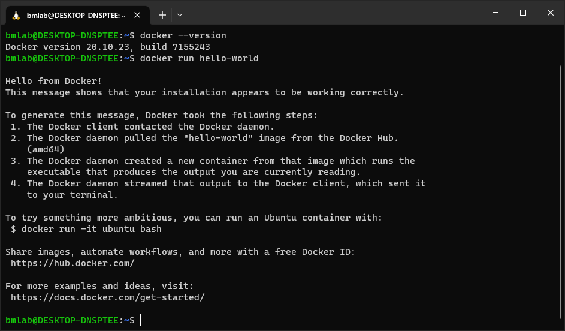

# Windows Installation Guide
{: .no_toc }

# TOC
{: .no_toc .text-delta }

1. TOC
{:toc}

---

For windows users, the installation guide on the original page might be outdated. In recent years, Microsoft has worked hard to help windows user have a nice environment to develop program. This is a guide that accommodate the recently updated steps to set up computing requirements for the course. We will install WSL version 2 (Windows Subsystem for Linux) with defaults Ubuntu distro. The Docker Toolbox for Windows is now deprecated, and has been replaced by Docker Desktop, which now support WSL. VS Code is highly recommended IDE, because it provide native support to work with WSL and Docker. Here is the step by step instruction to install all this necessary softwares.

{: .warning }
If you’re using VirtualBox or VMware for your works, there was a problem that WSL would not work in parallel with VirtualBox and VMware. It is said that the recent version of VirtualBox or VMware already solved the problem, and WSL version 2 now have no conflict with VirtualBox or VMware. However, I personally have no experience on VirtualBox or VMware, and did not test that yet. Please be cautious that there might be problem with WSL alongside with VirtualBox or VMware.

## Prerequisite
There are two prerequisite for following steps:
1. Your Windows 10, or Windows 11 is updated: the updated wsl and docker required Windows 10 version 21H1 or higher, or Windows 11 21H2 or higher. This steps have been tested on Windows 10 newest version. Please use **Windows Update** to make sure your system is updated.
2. Enable Virtualization in your BIOS setting, we need to check if your BIOS turn on the virtualization function, which is necessary for WSL. There are two ways to check:
First, click `ctrl+alt+del` then click Task Manager (工作管理員). Navigate to Performance tab, and check if Virtualization in *Enable*. If you cannot find the Virtualization information. Try next step.

Please search for powershell and run as administrator (以系統管理員身份執行).

It will open a powershell command-line interface, then input `Get-ComputerInfo -property "HyperV"`. Then, check if “VirtualizationFirmwareEnable” is “True”.

{: .note }
If the Virtualization is “Disable”, you need to go to BIOS setting and turn on the Virtualization function. Depending on your PC vendor or motherboard vendor (ASUS, Acer, Dell, … etc), there are different ways to go to BIOS settings, and the label for the Virtualization function is also different between chipset vendors (AMD or Intel). Thus, we cannot provide a common step-by-step instruction that help you to turn on the Virtualization. You can google your PC or motherboard vendor + chipset vendor + BIOS + Virtualization (e.g. `ASUS Intel Virtualization BIOS`) to find the way to turn on Virtualization. If you have difficulties in this, we would provide hands-on help, and please request the help on our Discord server.

## Windows Subsystem for Linux (WSL)
1. Please search for powershell and run as administrator (以系統管理員身份執行).

2. Input `wsl --install`. Then your PC will automatically install and set up all the environment for WSL version 2 with default Ubuntu distro.

3. You will see the screen below if you successfully installed WSL 2 with default Ubuntu distro. And the system need to reboot.

{: .note }
	- If the previous step did not install anything, there might be a problem on the automatic script to install WSL. You can find manual steps [here](https://learn.microsoft.com/en-us/windows/wsl/install-manual). If you follow the manual installation steps.

4. After rebooting your system, there will a window popped up and tell you that the Ubuntu is installing. After the installation of Ubuntu, a message prompted to ask you input a username, input the username preferred and pressed enter, and then enter password for the username.

	- If the window is not popped up, search `wsl` and click, you will see the window like above.
	
	

5. You will see the message to inform you taht the installation is successful, and you can now close the window.

6. The final step is check if we missed anythin. Please search for powershell and run as administrator again. Then, input `wsl.exe --update`. If you follow the steps, you probably won’t see anything need to update. By this step, the WSL 2 has been successful installed and ready to go.

## CLI (command-line interface)
For the course, you might see the instruction about “open terminal.” Here we provide two ways to open terminal, and the settings make it works better.

### Built-in CLI
1. You can search `wsl` or `ubuntu`. Because the WSL installation set the ubuntu as default distro, when you click `wsl` application, it refers to `ubuntu`. Thus, these two have identical functionality.

2. Open the application will prompt a window with `$` at the end, this is bash shell for your WSL. We can change some setting to make it works better. Right click on the top of window, and select “Properties”.

3. Go to Options tab and click “Use Ctrl+Shift+C V as Copy Paste”
 

4. Go to Terminal tab and click “Vertical Bar”

### Windows Terminal
Microsoft create their own terminal application in recent year. It will provide better visualization than built-in CLI. You can download and install “Windows Terminal” on [Microsoft Apps](https://apps.microsoft.com/store/detail/windows-terminal/9N0DX20HK701)

1. Click the “Windows Terminal” will open a powershell window. You can open a WSL terminal by click the down arrow and select “Ubuntu”.

2. This will create a bash shell for WSL Ubuntu like below. We can also change the default profile from powershell to WSL. To do this, click the down arrow and click “Settings.”

3. You can find most of settings here, but we would like to change the default profile as WSL, change the “Windows PowerShell” to “Ubuntu” (if you choose ubuntu as default WSL distro, it does not matter if you choose either penguin icon or ubuntu icon)

4. When you open a new Windows Terminal, you will see WSL bash shell is opened.

## VSCode
Please follow [Brainhack School installation guide](https://school.brainhackmtl.org/modules/installation/) to set up VSCode.

## Python
Please follow [Brainhack School installation guide](https://school.brainhackmtl.org/modules/installation/) to set up Python.

## Docker
We will follow the guides from Docker webpage and Microsoft WSL to set up Docker for WSL.
1. Go to the [Docker official website](https://docs.docker.com/desktop/install/windows-install/) and download Docker Desktop. Double click on the installer and run. When you see the configuration, please turn on “Use WSL 2 instead of Hyper-V.” 

2. The installer will ask you to log out and log in to make Docker works. The Docker Desktop will automatically startup after login. Read the agreement and you will see the information about starting Docker.

3. When the Docker initialization is done, it might show a tutorial guide. You can skip the guide. We need to set up and make sure Docker is working with WSL. Right click on the bottom Docker icon, and select “Settings”.

4. Make sure the “Use the WSL 2 based engine” is turned on.

5. Then go to “Resources”, and then “WSL integration”. Please make sure the “Enable integration with my default WSL distro” is turned on. We already set Ubuntu as default distro, so that it does not matter if we turn on or off the below Ubuntu distro.

6. All the settings are done. We can test if Docker works. Open your terminal for WSL. And input `docker --version`, and then input `docker run hello-world`. If there is no error prompts out, your Docker is ready to work.

